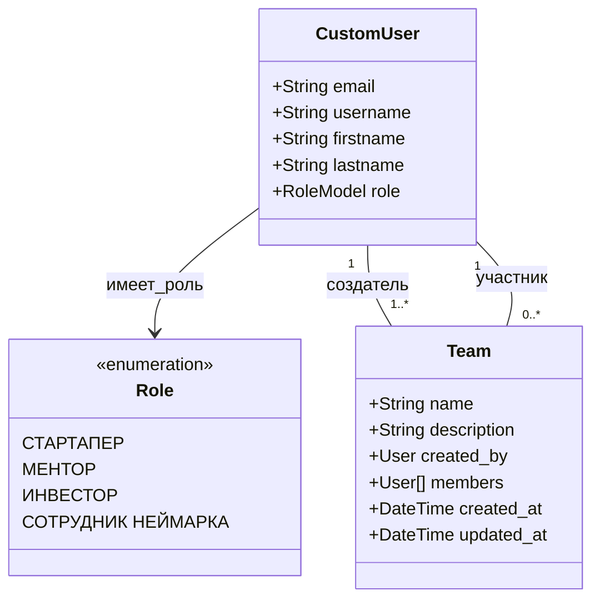

Модели данных

**Модели:**

**1. Пользователь**

* _EMAIL_

* _USERNAME (email)_

* _FIRSTNAME_

* _ROLE_

  * _ROLE_: _Стартапер, Ментор, Инвестор, Сотрудник НЕЙМАРКа_

* _STAFFSTATUS_

* _ACTIVE_

**2. Стартап**

* _NAME_

* _DESCRIPTION_

* _CREATEDBY_

* _MEMBERS_

* _CREATEDAT_

* _UPDATEDAT_

